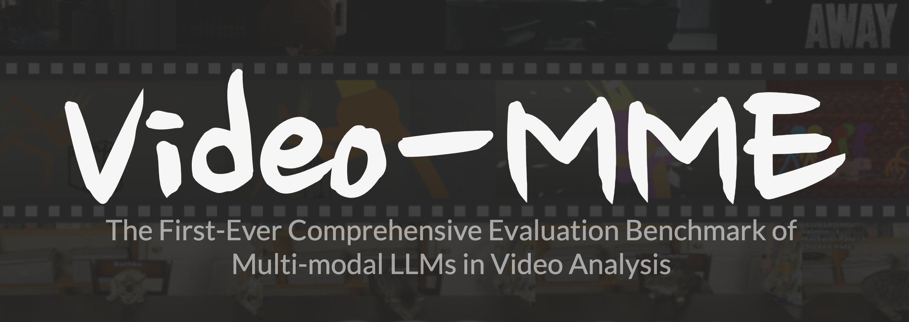
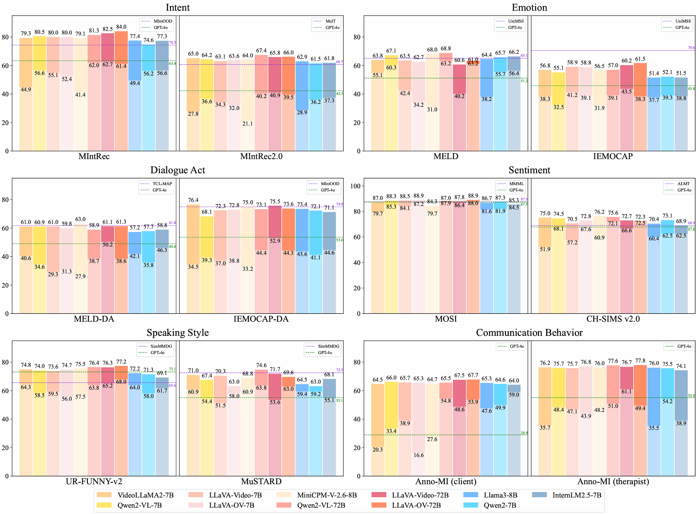
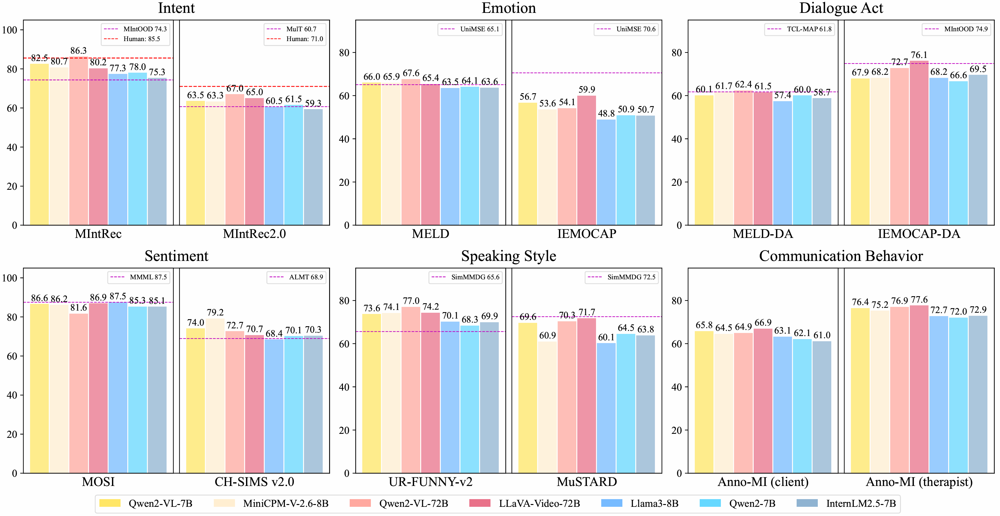

# MMLA : A Comprehensive Benchmark. Can Large Language Models Help Multimodal Language Analysis?


## Our Works

#### 🔥🔥🔥 MMLA : A Comprehensive Benchmark. Can Large Language Models Help Multimodal Language Analysis?




- **[2025.04.30]**: 🔥 We release the code related to evaluation of LLMs and MLLMs.
- **[2025.04.30]**: 🔥 We have released the [environment](https://github.com/QwenLM/Qwen2.5) required for evaluating large models.
- **[2025.04.30]**: 📜 Our paper [Can Large Language Models Help Multimodal Language Analysis? MMLA: A Comprehensive Benchmark](https://arxiv.org/abs/标号) is on arxiv.

**If our work is helpful to your research, please give us a star.** 🌟


### **The specific information of the evaluated is as follows：**

------

#### **Models**

|        Models         |                     Model scale and Link                     |                            Source                            | Type |
| :-------------------: | :----------------------------------------------------------: | :----------------------------------------------------------: | :--: |
|    Qwen2-Instruct     | 🤗 [0.5B](https://huggingface.co/Qwen/Qwen2-0.5B-Instruct) / [1.5B](https://huggingface.co/Qwen/Qwen2-1.5B-Instruct) / [7B]((https://huggingface.co/Qwen/Qwen2-7B-Instruct)) | [📜 Paper](https://arxiv.org/html/2407.10671v4)  / [ GitHub](https://github.com/QwenLM/Qwen2.5) | LLM  |
|    Llama3-Instruct    | 🤗 [8B ](https://huggingface.co/PartAI/Dorna-Llama3-8B-Instruct) / [3.1-8B](https://huggingface.co/meta-llama/Llama-3.1-8B-Instruct) / [3.2-1B](https://huggingface.co/meta-llama/Llama-3.2-1B-Instruct) / [3.2-3B](https://huggingface.co/meta-llama/Llama-3.2-3B-Instruct) | [📜 Paper](https://arxiv.org/abs/2407.21783) / [GitHub](https://github.com/meta-llama/llama-models/) | LLM  |
|   InternLM2.5-chat    | 🤗 [7B](https://huggingface.co/internlm/internlm2_5-7b-chat)  | [📜 Paper](https://arxiv.org/abs/2403.17297) / [GitHub](https://github.com/InternLM/InternLM) | LLM  |
|      VideoLLaMA2      |  🤗 [7B](https://huggingface.co/DAMO-NLP-SG/VideoLLaMA2-7B)   | [📜 Paper](https://arxiv.org/abs/2406.07476) / [GitHub](https://github.com/DAMO-NLP-SG/VideoLLaMA2) | MLLM |
|   Qwen2-VL-Instruct   | 🤗 [7B](https://huggingface.co/Qwen/Qwen2-VL-72B-Instruct) / [72B](https://huggingface.co/Qwen/Qwen2-VL-72B-Instruct) | [📜 Paper](https://arxiv.org/abs/2409.12191) / [GitHub](https://github.com/QwenLM/Qwen2.5-VL) | MLLM |
|      LLaVA-Video      | 🤗 [7B](https://huggingface.co/lmms-lab/LLaVA-Video-7B-Qwen2) / [72B](https://huggingface.co/lmms-lab/LLaVA-Video-72B-Qwen2) | [📜 Paper](https://arxiv.org/abs/2410.02713) / [GitHub](https://github.com/LLaVA-VL/LLaVA-NeXT?tab=readme-ov-file) | MLLM |
| llava-onevision-qwen2 | 🤗 [7B](https://huggingface.co/lmms-lab/llava-onevision-qwen2-7b-ov-chat) / [72B](https://huggingface.co/lmms-lab/llava-onevision-qwen2-72b-ov-chat) | [📜 Paper](https://arxiv.org/abs/2408.03326) / [GitHub](https://github.com/LLaVA-VL/LLaVA-NeXT?tab=readme-ov-file) | MLLM |
|     MiniCPM-V-2.6     |     🤗 [8B](https://huggingface.co/openbmb/MiniCPM-V-2_6)     | [📜 Paper](https://arxiv.org/abs/2408.01800) / [GitHub](https://github.com/OpenBMB/MiniCPM-o) | MLLM |

#### **Datasets**

|       Dimension        |       Dataset       |                            Source                            |                 Venue                  |
| :--------------------: | :-----------------: | :----------------------------------------------------------: | :------------------------------------: |
|         Intent         |       MIntRec       | [Paper](https://dl.acm.org/doi/10.1145/3503161.3547906) / [GitHub](https://github.com/thuiar/MIntRec) |                ACM 2022                |
|         Intent         |     MIntRec2.0      | [Paper](https://arxiv.org/abs/2403.10943) / [GitHub](https://github.com/thuiar/MIntRec2.0) |               ICLR 2024                |
|        Emotion         |        MELD         | [Paper](https://aclanthology.org/P19-1050/) / [GitHub](https://affective-meld.github.io/) |                ACL 2019                |
|        Emotion         |       IEMOCAP       | [Paper](https://link.springer.com/article/10.1007/S10579-008-9076-6) / [Laboratory](https://sail.usc.edu/iemocap/) | Language Resources and Evaluation 2008 |
|      Dialogue Act      |       MELD-DA       | [Paper](https://aclanthology.org/2020.acl-main.402/) / [GitHub](https://github.com/sahatulika15/EMOTyDA) |                ACL 2020                |
|      Dialogue Act      |     IEMOCAP-DA      | [Paper](https://aclanthology.org/2020.acl-main.402/) / [Laboratory](https://github.com/sahatulika15/EMOTyDA) |                ACL 2020                |
|       Sentiment        |        MOSI         | [Paper](https://ieeexplore.ieee.org/document/7742221) / [GitHub](https://github.com/CMU-MultiComp-Lab/CMU-MultimodalSDK) |     IEEE Intelligent Systems 2016      |
|       Sentiment        |    Ch-sims v2.0     | [Paper](https://arxiv.org/abs/2209.02604) / [GitHub](https://github.com/thuiar/ch-sims-v2) |               ICMI 2022                |
|     Speaking Style     |     UR-FUNNY-v2     | [Paper](https://aclanthology.org/D19-1211/) / [GitHub](https://github.com/ROC-HCI/UR-FUNNY) |                ACL 2019                |
|     Speaking Style     |       MuSTARD       | [Paper](https://aclanthology.org/P19-1455/) / [GitHub](https://github.com/Himanshu-sudo/MUStARD-dataset) |                ACL 2019                |
| Communication Behavior |  Anno-MI (client)   | [Paper ](https://doi.org/10.3390/fi15030110)/ [GitHub](https://github.com/uccollab/AnnoMI) |          Future Internet 2016          |
| Communication Behavior | Anno-MI (therapist) | [Paper](https://doi.org/10.3390/fi15030110) / [GitHub](https://github.com/uccollab/AnnoMI) |          Future Internet 2016          |


### The performance of the model on each dimension task

------

放一张雷达图


### Below is the performance leaderboard for models:

------


####  Rank of foundation models after zero-shot inference

| RANK |      Models      |  ACC  | TYPE |
| :--: | :--------------: | :---: | :--: |
|  🥇   |      GPT-4o      | 52.60 | MLLM |
|  🥈   |   Qwen2-VL-72B   | 52.55 | MLLM |
|  🥉   |   LLaVA-OV-72B   | 52.44 | MLLM |
|  4   | LLaVA-Video-72B  | 51.64 | MLLM |
|  5   |  InternLM2.5-7B  | 50.28 | LLM  |
|  6   |     Qwen2-7B     | 48.45 | LLM  |
|  7   |   Qwen2-VL-7B    | 47.12 | MLLM |
|  8   |    Llama3-8B     | 44.06 | LLM  |
|  9   |  LLaVA-Video-7B  | 43.32 | MLLM |
|  10  |  VideoLLaMA2-7B  | 42.82 | MLLM |
|  11  |   LLaVA-OV-7B    | 40.65 | MLLM |
|  12  |    Qwen2-1.5B    | 40.61 | LLM  |
|  13  | MiniCPM-V-2.6-8B | 37.03 | MLLM |
|  14  |    Qwen2-0.5B    | 22.14 | LLM  |


#### Rank of  Supervised fine-tuning (SFT) and Instruction Tuning (IT)

| Rank |         Models         |  ACC  | Type |
| :--: | :--------------------: | :---: | :--: |
|  🥇   |   Qwen2-VL-72B (SFT)   | 69.18 | MLLM |
|  🥈   | MiniCPM-V-2.6-8B (SFT) | 68.88 | MLLM |
|  🥉   |  LLaVA-Video-72B (IT)  | 68.87 | MLLM |
|  4   |   LLaVA-ov-72B (SFT)   | 68.67 | MLLM |
|  5   |   Qwen2-VL-72B (IT)    | 68.64 | MLLM |
|  6   | LLaVA-Video-72B (SFT)  | 68.44 | MLLM |
|  7   |  VideoLLaMA2-7B (SFT)  | 68.30 | MLLM |
|  8   |   Qwen2-VL-7B (SFT)    | 67.60 | MLLM |
|  9   |   LLaVA-ov-7B (SFT)    | 67.54 | MLLM |
|  10  |  LLaVA-Video-7B (SFT)  | 67.47 | MLLM |
|  11  |    Qwen2-VL-7B (IT)    | 67.34 | MLLM |
|  12  | MiniCPM-V-2.6-8B (IT)  | 67.25 | MLLM |
|  13  |    Llama-3-8B (SFT)    | 66.18 | LLM  |
|  14  |     Qwen2-7B (SFT)     | 66.15 | LLM  |
|  15  | Internlm-2.5-7B (SFT)  | 65.72 | LLM  |
|  16  |     Qwen-2-7B (IT)     | 64.58 | LLM  |
|  17  |  Internlm-2.5-7B (IT)  | 64.41 | LLM  |
|  18  |    Llama-3-8B (IT)     | 64.16 | LLM  |
|  19  |    Qwen2-1.5B (SFT)    | 64.00 | LLM  |
|  20  |    Qwen2-0.5B (SFT)    | 62.80 | LLM  |


### Fine-grained Performance on Different Dimensions

------

#### Comparison of zero-shot and supervised fine-tuning (SFT) performance




#### Instruction tuning results of MLLMs and LLMs




## Usage

If you want to perform zero-shot inference, supervised fine-tuning, and instruction fine-tuning of LLMs and MLLMs, please refer to the [src/LLaMA-Factory-main/README.md](./src/LLaMA-Factory-main/README.md) document

The models supported by this module are:

- LLMs: **Qwen2-0.5B**，**Qwen2-1.5B**，**Qwen2-7B**, **Llama3-8B**, **Llama3.1-8B**，**Llama3.2-1B**，**Llama3-3B**，**Internlm2.5-8B**
- MLLMs: **Qwen2-VL-7B**, **Qwen2-VL-72B**

If you want to perform zero-shot inference, supervised fine-tuning, and instruction fine-tuning of LLaVA series models, please refer to the [src/LLaVA-NeXT-main/README.md](./src/LLaVA-NeXT-main/README.md) document, which supports the following models:

- MLLMs: **LLaVA-ov-7B**, **LLaVA-Video-7B**，**LLaVA-ov-72B**，**LLaVA-Video-72B**

If you want to perform zero-shot inference, supervised fine-tuning, and instruction fine-tuning of the **MiniCPM-V-2.6-8B **model, please refer to it [src/Swift/README.md](./src/Swift/README.md)

If you want to perform zero-shot inference, supervised fine-tuning, and instruction fine-tuning of the **VideoLLaMA2-7B** model, please refer to it [src/VideoLLaMA2/README.md](./src/VideoLLaMA2/README.md)


## Citations

If you find this repo useful, you can cite our works as follows:

```
@inproceedings{zheng2024llamafactory,
  title={LlamaFactory: Unified Efficient Fine-Tuning of 100+ Language Models},
  author={Yaowei Zheng and Richong Zhang and Junhao Zhang and Yanhan Ye and Zheyan Luo and Zhangchi Feng and Yongqiang Ma},
  booktitle={Proceedings of the 62nd Annual Meeting of the Association for Computational Linguistics (Volume 3: System Demonstrations)},
  address={Bangkok, Thailand},
  publisher={Association for Computational Linguistics},
  year={2024},
  url={http://arxiv.org/abs/2403.13372}
}
```

```
@article{li2024llava,
  title={LLaVA-NeXT-Interleave: Tackling Multi-image, Video, and 3D in Large Multimodal Models},
  author={Li, Feng and Zhang, Renrui and Zhang, Hao and Zhang, Yuanhan and Li, Bo and Li, Wei and Ma, Zejun and Li, Chunyuan},
  journal={arXiv preprint arXiv:2407.07895},
  year={2024}
}
```

```
@misc{zhao2024swiftascalablelightweightinfrastructure,
      title={SWIFT:A Scalable lightWeight Infrastructure for Fine-Tuning},
      author={Yuze Zhao and Jintao Huang and Jinghan Hu and Xingjun Wang and Yunlin Mao and Daoze Zhang and Zeyinzi Jiang and Zhikai Wu and Baole Ai and Ang Wang and Wenmeng Zhou and Yingda Chen},
      year={2024},
      eprint={2408.05517},
      archivePrefix={arXiv},
      primaryClass={cs.CL},
      url={https://arxiv.org/abs/2408.05517},
}
```

```
@article{damonlpsg2024videollama2,
  title={VideoLLaMA 2: Advancing Spatial-Temporal Modeling and Audio Understanding in Video-LLMs},
  author={Cheng, Zesen and Leng, Sicong and Zhang, Hang and Xin, Yifei and Li, Xin and Chen, Guanzheng and Zhu, Yongxin and Zhang, Wenqi and Luo, Ziyang and Zhao, Deli and Bing, Lidong},
  journal={arXiv preprint arXiv:2406.07476},
  year={2024},
  url = {https://arxiv.org/abs/2406.07476}
}
```

